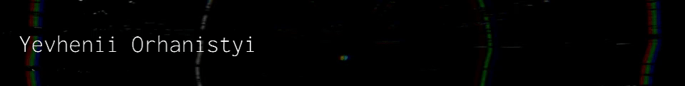

### I'm

  

    
    
    
  

  

### About me

  I'm <b>Yevhenii</b> from Ukraine,  and I am a passionate self-taught frontend developer. I really enjoy learning languages and frameworks like React.. I take great care in the experience, architecture, and code quality of the things I build.

  
#### Languages and Tools

### My Stats :

